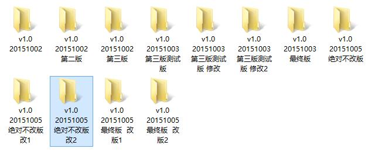

# git 简明使用教程
---
## 1. git简介
**git是什么？**

git是目前世界上最先进的*分布式*版本控制系统（没有之一）。

**git有什么特点？**

易用，高效，免费

**为什么要用版本控制系统？**

先不直接回答为什么，看图

超不过1天，你就不会记得曾经改过什么。如果之前删除过的代码想在找回来，其工作量会让人抓狂。

如果是多人协作的开发工作，要么单线开发，一个开发完了把代码给另一个人，要么两人开发的代码完全独立，如果有个人无意间发现你的代码有BUG，顺带给你改掉了，那么合并代码的时候，你会发现人性的险恶。。。

如果有人在代码中添加了版本更新说明，像这个样子

	 * 1993-09-02    Philip Gladstone
	 *      Created file with time related functions from sched/core.c and adjtimex()
	 * 1993-10-08    Torsten Duwe
	 *      adjtime interface update and CMOS clock write code
	 * 1995-08-13    Torsten Duwe
	 *      kernel PLL updated to 1994-12-13 specs (rfc-1589)
	 * 1999-01-16    Ulrich Windl

那么恭喜你，你已经进入版本控制的"蒸汽时代"了

### 1.1 git由来
很多人都知道，Linus在1991年创建了开源的Linux，从此，Linux系统不断发展，已经成为最大的服务器系统软件了。

Linus虽然创建了Linux，但Linux的壮大是靠全世界热心的志愿者参与的，这么多人在世界各地为Linux编写代码，那Linux的代码是如何管理的呢？

事实是，在2002年以前，世界各地的志愿者把源代码文件通过diff的方式发给Linus，然后由Linus本人通过手工方式合并代码！

你也许会想，为什么Linus不把Linux代码放到版本控制系统里呢？不是有CVS、SVN这些免费的版本控制系统吗？因为Linus坚定地反对CVS和SVN，这些集中式的版本控制系统不但速度慢，而且必须联网才能使用。有一些商用的版本控制系统，虽然比CVS、SVN好用，但那是付费的，和Linux的开源精神不符。

不过，到了2002年，Linux系统已经发展了十年了，代码库之大让Linus很难继续通过手工方式管理了，社区的弟兄们也对这种方式表达了强烈不满，于是Linus选择了一个商业的版本控制系统BitKeeper，BitKeeper的东家BitMover公司出于人道主义精神，授权Linux社区免费使用这个版本控制系统。

安定团结的大好局面在2005年就被打破了，原因是Linux社区牛人聚集，不免沾染了一些梁山好汉的江湖习气。开发Samba的Andrew试图破解BitKeeper的协议（这么干的其实也不只他一个），被BitMover公司发现了（监控工作做得不错！），于是BitMover公司怒了，要收回Linux社区的免费使用权。

Linus可以向BitMover公司道个歉，保证以后严格管教弟兄们，嗯，这是不可能的！

实际情况是这样的：Linus花了两周时间自己用C写了一个分布式版本控制系统，这就是Git！一个月之内，Linux系统的源码已经由Git管理了！牛是怎么定义的呢？大家可以体会一下。

Git迅速成为最流行的分布式版本控制系统，尤其是2008年，GitHub网站上线了，它为开源项目免费提供Git存储，无数开源项目开始迁移至GitHub，包括jQuery，PHP，Ruby等等。

历史就是这么偶然，如果不是当年BitMover公司威胁Linux社区，可能现在我们就没有免费而超级好用的Git了。

小结：**牛人就是有性格！**

### 1.2 git与svn

git与svn都是版本控制系统，而且都是免费的，不同的是，git是分布式的，svn的集中式的。

先说svn这种集中式的版本控制系统，版本库是存放在服务器端的，当需要干活的时候，需要先从服务器上把最新的代码更新到本地，干完活以后再把代码推送给服务器。这么来看没有什么不妥，但是有一点比较麻烦，就是必须有网才能工作。而且一旦服务器挂掉，所有版本库也都没了（虽然svn有热备的功能，但是成本有那么一点点高）

再说说git，分布式的版本控制和集中式有什么不同呢？那就是**没有服务器**。每个人机器上都是一个完整的版本库，这样你工作的时候就不需要联网了，如果你的机器不幸牺牲，从别人机器上再拷贝一个就好了。如果是多人协作，合并的时候把你提交的代码推送给同事就好了，同事合并完你再拉取到本地即可。如果你觉得这样不方便，那么就找一台24小时开机的机器充当”服务器“好了，这个”服务器“仅仅是充当中转的作用，没有它也能工作，当然了，有它以后可能会更安全和方便一些。

当然除了SVN，还有一些商用的版本管理工具，比如IBM的ClearCase，它的特点就是bigger than Windows，slower than tortoise。还有微软的VSS，由于其反人类的设计，连微软自己都不好意思用了。

## 2. git安装
### 2.1 windows 安装git

[点这里下载，点这里下载，点这里下载](http://git-scm.com/download/)

安装过程略，一路下一步即可。。。

安装完毕后，点击鼠标右键，会看到

**Git Bash Here**：这是一个mingwin的终端，可以在里面执行git指令

**Git GUI Here**：这是git提供的一个UI界面，不过超级难用

如果你不喜欢用命令行，习惯了tortoise SVN那种操作方式，那么可以下载[tortoise Git](http://tortoisegit.org/download/)来用，不过我还是建议用命令行，能用键盘搞定的事情干嘛用鼠标呢。

### 2.2 linux 安装git

linux安装git就方便多了。

	Debian/Ubuntu
	$ apt-get install git

	Fedora
	$ yum install git

	Gentoo
	$ emerge --ask --verbose dev-vcs/git

	Arch Linux
	$ pacman -S git

	openSUSE
	$ zypper install git

	FreeBSD
	$ cd /usr/ports/devel/git
	$ make install

	Solaris 11 Express
	$ pkg install developer/versioning/git

	OpenBSD
	$ pkg_add git

如果是其他版本的linux，可以通过源码安装。源码可以到[git官网](https://www.kernel.org/pub/software/scm/git/)上下载，也可以到[github](https://github.com/git/git)上下载。

## 3. git使用
### 3.0 配置

在使用git之前，需要配置一下user.name和user.email。当多人协同工作的时候，可以通过log查看到提交人的信息。

	git config --global user.email "xxx@xxx.com"
	git config --global user.name "yourname"

### 3.1 暂存区

git与svn唯一的不同之处就是多了一个暂存区的概念。下面说一下git的工作区、暂存区和版本库之间的关系。

- 工作区：就是你工作的目录，可以看到代码的地方。
- 暂存区：在.git下面，属于版本库的一部分，记录你添加但是没有提交的修改。
- 版本库：在.git下面，这里记录了版本的所有信息。

他们之间的关系：

在解释暂存区之前，先说一下git的设计理念，就是检测修改而不是文件，增加、修改和删除都属于修改。下面看一下为什么说git检测的是修改。

git add 命令就是把**修改**加入到**暂存区**里面去，待所有的修改都完毕以后，可以通过commit将暂存区的修改提交到版本分支中。

有人可能会问，git这个暂存区完全看不到有毛用啊，与SVN比起来没有什么特别的，而且还增加了操作步骤。别急，下面会有说暂存区的妙用。

### 3.2 创建git仓库

创建git仓库非常简单，有2中方式可以选择：

- 如果是本地工作用的仓库，以后会推送到远程服务器，那么直接：
	
	git init xxx.git

- 如果仅仅是被用来做推送的远程仓库，那么：

	git init --bare xxx.git

这两种创建git仓库的区别，就是第一种有工作区，另一个没有工作区。

### 3.3 添加修改

git添加修改使用 `git add` 命令。

`git add`就是将文件的修改加入到暂存区，这一点从svn迁过来的同学要注意一下，每次修改完都需要add以下。

add完以后，`git status`看一下信息

`git status`告诉我们，需要提交的修改。

例如我们开发了一个a.c文件，所有的功能都实现了，但还没有编译测试，所以还不能提交到版本库中。现在又需要增加一个新功能，那么我们可以先将a.c add到暂存区，再继续开发a.c。在写代码的过程中，发现路走偏了，需要将新开发的都去掉，那么可以直接撤销修改即可，a.c又回到了add时的状态。

**PS: .gitignore**

在git add的时候，有些文件我们永远也不想放到暂存区，比如.o文件，同时我们又不想每次git add的时候都小心翼翼的填写全路径。

这时候我们可以使用git提供的.gitignore文件来忽略掉我们不想add的文件。.gitignore放在工作区，规则如下：

	# 忽略*.o和*.a文件
	 *.[oa]

	# 忽略*.b和*.B文件，my.b除外
	*.[bB]
	!my.b

	# 忽略dbg文件和dbg目录
	dbg

	# 只忽略dbg目录，不忽略dbg文件
	dbg/

	# 只忽略dbg文件，不忽略dbg目录
	dbg
	!dbg/

	# 只忽略当前目录下的dbg文件和目录，子目录的dbg不在忽略范围内
	/dbg

### 3.4 提交到版本库

需要提交的修改添加到版本库以后，如果确认无误，就可以提交到分支中了。

git提交暂存区修改到分支使用`git commit`命令

注意：git与SVN不同的一点是，svn可以不输入日志信息，但是git是一定要输入的。

可以用`git commit -m "xxx"`来指定日志信息，也可以直接`git commit`，git会弹出一个编辑页，让你输入日志。

如果你不喜欢nano编辑器，习惯了vim编辑，可以通过`git config core.editor vim`来配置编辑器。

提交完分支以后，可以通过`git log`看一下提交日志

git 使用一串16进制数来表示版本号，通过这个来保证版本号不重复。基本上前7位就可以保证唯一性了。

### 3.5 版本回退

我们在readme.txt中添加一行："your are stupid"，然后提交到仓库。提交过程略

过了一天，你突然发现这句话不应该出现在这个版本中，怎么办。好办，版本回退到上一个版本。

版本回退使用`git reset`命令，有三个参数`--mixed（默认）`、 `--soft`和`--hard`。下面说说这三种方式的区别：

- --mixed 保留修改，文件在工作区，回退commit信息，改参数是默认参数。
- --soft 保留修改，文件在暂存区，回退commit信息
- --hard 不保留修改，文件在工作区，回退commit信息

这里我们使用默认参数，也就是--mixed

HEAD指当前版本，上一版本用HEAD^，上上版本用HEAD^^，上上上版本可以用HEAD~3。

如果不记得是上几个版本了怎么办，还记得上面说的版本号么，可以直接用版本号，不需要全部，前7位就可以了。

又过了一天，你又后悔版本回退了，怎么办，这时候HEAD没法用了，而你又记不住版本号。没关系，可以用`git reflog`看一下所有历史提交。

版本号又来了。

### 3.6 撤销修改

目前为止，git常用的功能已经介绍的差不多了，你基本上已经可以使用git进行工作了。

撤销修改这个功能你可能永远也用不上，但是某些情况下，你还是需要它的。

场景一：

你正在写某个文件，突然你把文件内容给删掉了，而且这时候你还保存了。不要慌，我们可以用`git checkout -- filename`来丢弃工作区的修改。这时候你误删内容的文件又回来了，只是你新添加的内容没有了。

场景二：

场景一 + 你还把修改add到暂存区了，这时候用场景一的命令已经没用了，怎么办呢？我们可以用`git reset HEAD filename`，这样就回到了场景一，接下来你就知道怎么做了吧。

场景三：

场景一 + 场景二 + 你还commit到版本库了。没关系，版本回退，用`git reset HEAD^`，回到场景一。

## 4. 分支管理

svn也有分支管理，但是用过之后你会发现，这些版本控制系统创建和切换分支比蜗牛还慢，简直让人无法忍受，结果分支功能成了摆设，大家都不去用。

但Git的分支是与众不同的，无论创建、切换和删除分支，Git在1秒钟之内就能完成！无论你的版本库是1个文件还是1万个文件。

### 4.1 创建分支

git创建分支使用`git branch xxx`命令，`git branch`可以查看到当前仓库的分支，选中的分支前面有 '*'。

使用git init创建仓库的时候，git会自动创建一个master分支。

切换分支使用 `git checkout xxx`命令，也可以在创建分之的时候直接`git checkout -b xxx`，创建分之并切换。

### 4.2 合并分支

加入在dev分支上修改了readme.txt文件

需要合并到master分支上，那么切换到master分支上，然后

### 4.3 解决冲突

合并分支不可能百分百成功，在正常的开发中肯定会遇到冲突。

例如master上我们对readme.txt做了修改，并提交；dev上也做了修改，并提交，那么dev合并到master分支上就会冲突

git status 查看状态

git diff 查看改动

从图中可以按到，master增加了hello，而dev增加了hi，在同一行上，所以冲突了。我们修改一下内容，两行都保留，再add, commit提交。

通常，合并分支时，如果可能，git会用Fast forward模式，但这种模式下，删除分支后，会丢掉分支信息。

如果要强制禁用Fast forward模式，git就会在merge时生成一个新的commit，这样，从分支历史上就可以看出分支信息。命令为`git merge --no-ff xxx`

### 4.4 删除分支

git 删除分支使用`git branch -d xxx`

如果提示分支曾经被合并过，不能删除，可以尝试使用`git branch -D xxx`

### 4.5 分支管理策略

在实际开发中，我们应该按照几个基本原则进行分支管理：

首先，master分支应该是非常稳定的，也就是仅用来发布新版本，不能在上面干活；

那在哪干活呢？干活都在dev分支上，也就是说，dev分支是不稳定的，到某个时候，比如1.0版本发布时，再把dev分支合并到master上，在master分支发布1.0版本；

你和你的小伙伴们每个人都在dev分支上干活，每个人又都有自己的分支，时不时地往dev分支上合并就可以了。

所以，团队合作的分支看起来就像这样：

## 5 远程仓库

到目前为止，我们已经可以对git的本地仓库操作自如了。如果是多人协作工作的话，一个充当服务器的远程仓库会简化大家交换修改的工作量。

### 5.1 创建远程仓库

如果只是自己使用git，那么可以直接在服务器端找个空目录，`git init --bare work.git`即可，客户端使用`git clone yourname@yourip:/git_path/work.git`来克隆。

如果是多人协同工作，那么建议使用gitlab来做管理，这样会省去大部分配置的时间。

目前gitlab提供了centos/ubuntu的一键安装的安装包，安装和使用还是比较方便的。推荐到清华镜像站去下载，速度比较快。

### 5.2 克隆远程仓库

我们大多数人肯定都用过github下载过代码，github提供了一个连接，类似`https://github.com/xxx/xxx.git`

我们在本地执行`git clone https://github.com/xxx/xxx.git`就可以将github上的代码工程克隆到本地了。就是这么简单

除了https方式，github还提供了ssh的方式。地址类似`git@github.com/xxx/xxx.git`，相比https方式，ssh方式更快。

git克隆远程，会自动将master和远程的origin/master链接。origin是远程库的默认名字，一看到origin就知道是远程库，当然你也可以更改。

我们可以通过`git remove -v`查看远程仓库的地址

### 5.3 推送到远程仓库

这时候假如你已经从服务器上clone了仓库到本地，并创建了一个dev分支，现在要推送到远程，那么可以`git push origin dev`

如果没有意外的话，你的远程分支就推送到服务器上了。

如果服务器上已经有dev分之且与你修改的内容有冲突的话，git会提示你先pull

这时候`git pull origin dev`的时候报错了，因为你还没有将本地的dev与origin/dev链接。那么先`git branch --set-upstream dev origin/dev`进行链接

这时候再进行pull就可以了，如果有冲突解决冲突，然后再push到origin/dev分支中。

为了避免这种情况，可以直接创建origin dev和本地dev链接分支。`git checkout -b dev origin/dev`，这时候本地的dev和origin/dev就链接上了。

## 6. 指令快查

- git add 加入工作区修改到暂存区
- git commit 提交暂存区修改到仓库
- git status 列出文件修改状态
- git diff 列出工作区与版本库之间的差异
- git diff HEAD HEAD^ filename.txt 列出filename.txt当前版本和上一版本差异
- git reset HEAD^ 回退到上一版本，且保存修改到工作区
- git reset --soft HEAD^ 回退到上一版本，且保存修改到暂存区
- git reset --hard HEAD^ 回退到上一版本，不保存修改
- git reflog 查看历史版本
- git checkout -- filename.txt 放弃工作区filename.txt的修改
- git reset HREAD filename.txt 放弃暂存区filename.txt的修改
- git rm 从工作区删除文件并将修改加入到暂存区
- git branch 创建分支
- git checkout 切换分支
- git chekcout -b 创建并切换分支
- git remove -v 查看远程分之
- git clone 拉取远程分支到本地
- git push 推送本地分支到远程
- git merge 合并分之
- git branch -d 删除分支
- git branch -D 强制删除分支
- git log 查看日志
- git stash 暂存工作区
- git stash list 查看暂存列表
- git stash pop 弹出暂存工作区（栈顶）
- git stash apply stash@{0} 弹出指定暂存工作区

## 7. git 自定义配置

git 支持多种自定义的配置，根据个人喜好自行决定配置那些。

如果是针对全局的配置，那么要加上--global，例如

	git config --global alias.ci commit

下面是我的git自定义配置

	git config --global alias.ci=commit
	git config --global alias.co=checkout
	git config --global alias.st=status
	git config --global alias.br=branch
	git config --global alias.lg=log --color --graph --pretty=format:'%Cred%h%Creset -%C(yellow)%d%Creset %s %Cgreen(%cr) %C(bold blue)<%an>%Creset' --abbrev-commit
	git config --global core.editor=vim  
