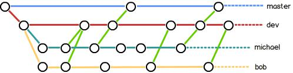
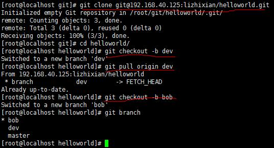

# git 分支管理策略

---

## 0. 一段发自内心的废话

为什么要用git，之前的一个培训文档已经说的很清楚了：git是目前为止市面上最先进的、免费的、易学易用的、符合人性的版本管理工具。

如果不出我的预料，我们中的人之前都用过svn，而且基本没用过svn的分支管理，svn也就是拿来做一个备份工具，或者干脆是用来应付某些指标，即使有人用过分支管理，也是用的一肚子火。

与svn相比，git的精华就是分支管理，既然是精华，肯定有其独到之处：

* git管理的项目，工作区只有一个，也就是说无论怎么切换分支，都在一个目录下
* git分支的切换速度非常快，虽不能说是刹那间，但至少能让你感觉很快很快
* git是分布式的，你可以任意创建分支并蹂躏它，别人不会发现的，嘿嘿嘿

git分支虽然强大，但是用不好的话就没有任何价值，就像开着兰博基尼跑在早高峰的四环路一样,跑不过自行车。

好了，说了这么多废话，目的就是让你对git的分支管理有些感觉，有信心从svn分支管理的阴影中走出来。

接下来的2个节，我们按照从理论到实践的革命路线，带大家正确认识git的分支管理，以及如何爱上git分支。

## 1. 理论-git分支管理模型

```
Q: 大神，为什么要用分支开发？
A: 因为这是一个充满爱的世界，你会犯错，也会被原谅。
Q: 大神，我懂了，你是让我放心大胆的去犯错！
A: 开发经理不打断你的腿！
```

git的分支管理不仅适合 **有多人合作开发** 的项目，也适合 **只有一个开发者** 的个人项目。

下图是一个典型的git分支管理策略：



看不懂吧，下面我用通俗而优美的文字解读一下：

假设：这个项目叫：helloworld，有2个开发者michael和bob，michael是项目的master，bob是developer。项目托管在gitlab上。

在开始工作之前，关于分支有几点需要强调一下，强调一下，强调一下：

1. master分支不允许用来开发，master分支上永远是稳定的代码
2. dev分支是开发分支，上面的代码比master高一个版本且可能不是稳定的
3. 个人分支可以push到服务器上，也可以只在本地。如果你有删东西的习惯，最好还是push到服务器
4. 可以用tag做版本标记，这一点之前的培训没有提到过，这里详细补充说明一下。

现在开始工作：

1. 项目经理在gitlab上创建helloworld仓库\(这太简单了\)，添加readme，然后将michael和bob加入项目的members并设定权限
2. 项目经理将仓库地址告诉michael和bob
3. michael从仓库地址clone下来项目，此时只有master分支
4. michael在本地创建并切换到dev分支，然后将dev分支push到gitlab上，此时helloworld在gitlab上有2个分支了：master和dev
5. michael在本地创建并切换到michael分支，用于feature开发
6. 现在轮到bob了，bob从仓库地址clone下来项目，此时bob也只有master分支
7. bob在本地创建并切换到dev分支，然后执行一次pull origin dev，将dev的源码pull到本地
8. bob在本地创建并切换到bob分支，用于feature开发
9. 好了，到此为止，一个项目的分支模型就建好了，虽然我上面说的有8条，但是操作起来绝对不超过1分钟（前提是你像我一样熟练，嘿嘿嘿）

准备工作做好以后，下面就正式进入开发流程了:

1. michael开发了一段时间，完成了一个小功能（本地已经commit）
2. michael本地自测以后发现没有问题，可以合并到dev分支
3. michael在本地切换到dev分支，在合并michael之前，先更新一下dev: pull origin dev（dev可能被bob提交过）
4. dev更新完毕后\(这个更新一般不会有冲突\)，下面合并michael到dev: merge michael
5. 合并可能会出现冲突，解决完冲突后，将更改add，然后commit，再push origin dev
6. michael再切换回michael分支，michael可以merge dev，也可以pull origin dev到michael，将michael和dev同步
7. 至此michael合并dev完毕
8. 下面轮到bob了，bob合并bob分支到dev的流程与michael一样，都是：切换dev-&gt;更新dev-&gt;合并自己的feature分支到dev-&gt;解决冲突-&gt;commit-&gt;push-&gt;切换回自己的feature分支-&gt;同步dev与自己的feature分支
9. michael比bob多一个权限，就是合并dev到master。当michael和bob合作开发出一个版本以后，且测试从dev拿到的代码测试暂时没发现问题，michael就可以将dev合并到master了。
10. michael切换到master，然后先更新master（如果只有一个master权限者的话，这一步可以省略），然后merge dev到master\(这一步不会出现冲突，除非有人不守规矩\)，最后push master到origin master

如果master是一个可发布的版本，那么可以使用tag做一个发布标签，如 git tag v1.0，然后git push origin v1.0。

关于tag的具体的用法在下一节详细说明一下。

通过我上面通俗而又优美的文字描述，我想你一定看的脑袋都大了，没关系，我们看示例。

## 2. 实践-项目开发场景

我\(lizhixian\)是helloworld的项目经理，我在gitlab上创建了一个helloworld项目


添加readme.md


我将micheal和bob加入到项目的members，并设定他们的权限


我将项目的地址告诉了micheal和bob

```
我：hi, micheam and bob.
helloworld的仓库地址是：git@192.168.40.125:lizhixian/helloworld.git
项目主页是：http://192.168.40.125/lizhixian/helloworld

micheal: 好的
bob: 好的
```

micheal从仓库地址clone项目到本地


此时只有master分支


Micheal在本地创建dev分支并push到gitlab上


此时gitlab上有master和dev两个分支


Micheal在本地创建micheal分支


Micheal的准备工作已经完成，下面轮到bob了



到此，helloworld项目的分支模型就创建完毕了。Micheal和bob可以分别在自己的feature分支上进行开发了。

假如Micheal开发了一段时间以后，自测没有问题，可以提交到dev上，那么Micheal可以


我们看到Micheal合并micheal到dev是一路顺风的，没有冲突。那么假如遇到冲突怎么办，下面看看bob的合并


我们发现helloworld.txt有冲突了


**下面解决冲突，解决的过程需要冲突的双方共同来协商，这个东西机器不能帮助你自动完成。冲突解决完毕后，切记要add**


目前为止，已经给大家演示了git的分支管理策略，开发者通过dev分支来进行源代码的交换。

上面只是演示了2个开发者的开发流程，如果有多个开发者的话，流程也是一致的，都是通过dev来做代码交换。

如果dev上的代码已经测试完毕，暂时没有bug了，那么就可以合并到master上


下面再说一下分支管理的一些技巧：

1. 本地的dev分支最好每天都更新一下，保持与服务器的同步
2. 如果dev有更新，就合并到自己的feature分支上。这样可以防止最后合并feature到dev的时候，出现灾难
3. 最好学会使用命令行工具

上面说了分支如何使用，其实git还有一个非常好的功能就是标签-tag。

举个例子，helloworld是一个持续开发的项目，有详细的版本规划，如果我们每个版本都建立一个分支的话，这样虽然也能达到版本发布的目的，但是不安全，因为分支可能被别人改动。

git tag的使用比分支还要简单，简直一学就会

比如helloworld的master上的代码可以发布为v1.0版本，那么

```
[root@localhost helloworld]# git tag v1.0
[root@localhost helloworld]# git tag
v1.0
[root@localhost helloworld]#
```

这样，master就被打上了标签v1.0，也就是v1.0对应当前master的快照

如果需要给标签加上日志，那么

```
[root@localhost helloworld]# git tag -a v1.0 -m 'helloworld v1.0'
[root@localhost helloworld]# git tag
v1.0
[root@localhost helloworld]# git show v1.0
tag v1.0
Tagger: root <root@localhost.localdomain>
Date:   Tue Jan 5 18:07:22 2016 +0800

helloworld v1.0
....
```

以上打的tag都是在本地，服务器端是看不到的（git是分布式的嘛），如果要共享tag，那么怎么办？push

```
[root@localhost helloworld]# git push origin v1.0
Counting objects: 1, done.
Writing objects: 100% (1/1), 160 bytes, done.
Total 1 (delta 0), reused 0 (delta 0)
To git@192.168.40.125:lizhixian/helloworld.git
 * [new tag]         v1.0 -> v1.0
[root@localhost helloworld]# 
```

这时候就可以在gitlab上看到你推送的tag了


那么tag如何使用呢？很简单，简直一学就会

假如helloworld已经开发到了v2.0，这时候v1.0发现了一出bug，我们需要进行修复

```
[root@localhost helloworld]# git checkout -b v1.0_bugfix v1.0
Switched to a new branch 'v1.0_bugfix'
```

到了，到此git分支策略的理论和实践我们都过了一遍，顺带送了大家tag的使用方法。

我还是那句话：任何惊艳的技艺都是勤学苦练出来的。希望大家会用git，爱上git。 see you

